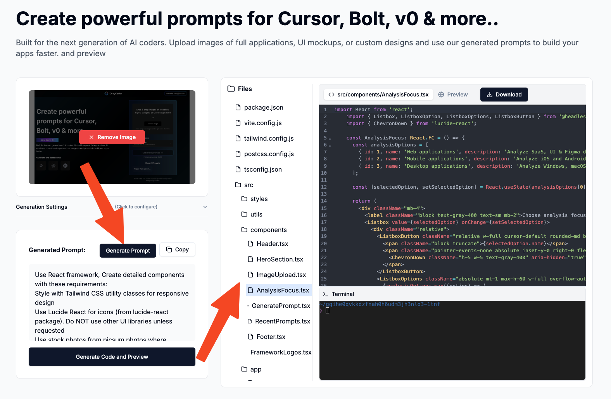

# super-copy-coder
An AI-powered tool that generates detailed development prompts from UI designs and mockups. Perfect for developers using modern AI coding tools like Cursor, Bolt, and v0.dev.

## Preview

### Key Capabilities:

1. **Upload & Analysis**
   - Drag & drop or click to upload UI designs
   - Supports various image formats
   - Real-time visual feedback

2. **Smart Generation**
   - Structured prompt generation
   - Temperature control for creativity adjustment
   - Real-time streaming output with Markdown formatting

3. **Quick Integration**
   - Direct access to Bolt, v0.dev, and Cursor
   - One-click copy functionality
   - Seamless workflow integration

## Features

- **Image Analysis**: Upload UI designs, mockups, or application screenshots
- **Smart Prompt Generation**: Generates detailed, structured prompts optimized for AI coding tools
- **Multiple Application Types**: Support for web, mobile, and desktop application analysis
- **Adjustable AI Parameters**: Control the creativity level with temperature adjustment
- **Real-time Streaming**: See the prompt generation in real-time
- **Markdown Support**: Generated prompts are formatted in Markdown for better readability
- **Quick Access Tools**: Direct integration with popular AI development tools
  - Bolt (https://bolt.new)
  - v0.dev
  - Cursor

## Tech Stack

- Next.js 14 (App Router)
- TypeScript
- Tailwind CSS
- OpenAI/Gemini API Integration
- React Markdown
- Lucide Icons
